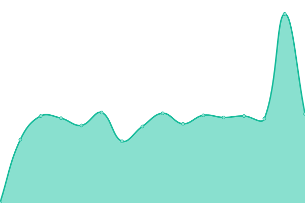
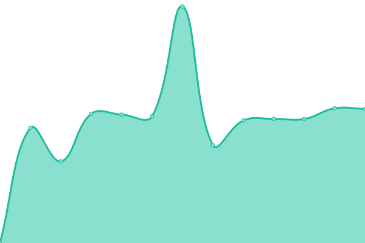

# [📈 Live Status](https://demo.upptime.js.org): <!--live status--> **🟩 All systems operational**

This repository contains the open-source uptime monitor and status page for [Upptime](https://upptime.js.org), powered by [Upptime](https://github.com/upptime/upptime).

With [Upptime](https://upptime.js.org), you can get your own unlimited and free uptime monitor and status page, powered entirely by a GitHub repository. We use [Issues](https://github.com/upptime/upptime/issues) as incident reports, [Actions](https://github.com/dani-Devofficial/DaniLabStatus/actions) as uptime monitors, and [Pages](https://demo.upptime.js.org) for the status page.

<!--start: status pages-->
<!-- This summary is generated by Upptime (https://github.com/upptime/upptime) -->
<!-- Do not edit this manually, your changes will be overwritten -->
<!-- prettier-ignore -->
| URL | Status | History | Response Time | Uptime |
| --- | ------ | ------- | ------------- | ------ |
|  [DaniLab Homepage](https://dani.ggm.kr) | 🟩 Up | [dani-lab-homepage.yml](https://github.com/danidevlab/DaniLabStatus/commits/HEAD/history/dani-lab-homepage.yml) | 

 612ms
     
 | 

<a href="https://status.dani.ggm.kr/history/dani-lab-homepage">100.00%</a>
    

|  [Sayknow Homepage](https://sayknow.ggm.kr) | 🟩 Up | [sayknow-homepage.yml](https://github.com/danidevlab/DaniLabStatus/commits/HEAD/history/sayknow-homepage.yml) | 

 673ms
     
 | 

<a href="https://status.dani.ggm.kr/history/sayknow-homepage">100.00%</a>
    

|  [Sayknow Count Server](https://vqtolrqlqvfpzjsedjrw.supabase.co/functions/v1/smooth-task/?askdata=hallo) | 🟩 Up | [sayknow-count-server.yml](https://github.com/danidevlab/DaniLabStatus/commits/HEAD/history/sayknow-count-server.yml) | 

 25730ms
     
 | 

<a href="https://status.dani.ggm.kr/history/sayknow-count-server">21.15%</a>
    

|  [HuggingFace Sayknow](https://sayknowlab-sayknow-v1.hf.space) | 🟩 Up | [hugging-face-sayknow.yml](https://github.com/danidevlab/DaniLabStatus/commits/HEAD/history/hugging-face-sayknow.yml) | 

 215ms
     
 | 

<a href="https://status.dani.ggm.kr/history/hugging-face-sayknow">100.00%</a>
    

|  [Status Page](https://status.dani.ggm.kr/) | 🟩 Up | [status-page.yml](https://github.com/danidevlab/DaniLabStatus/commits/HEAD/history/status-page.yml) | 

 575ms
     
 | 

<a href="https://status.dani.ggm.kr/history/status-page">100.00%</a>
    

<!--end: status pages-->

[**Visit our status website →**](https://demo.upptime.js.org)

## 📄 License

- Powered by: [Upptime](https://github.com/upptime/upptime)
- Code: [MIT](./LICENSE) © [Anand Chowdhary](https://anandchowdhary.com), supported by [Pabio](https://pabio.com)
- Data in the `./history` directory: [Open Database License](https://opendatacommons.org/licenses/odbl/1-0/)
